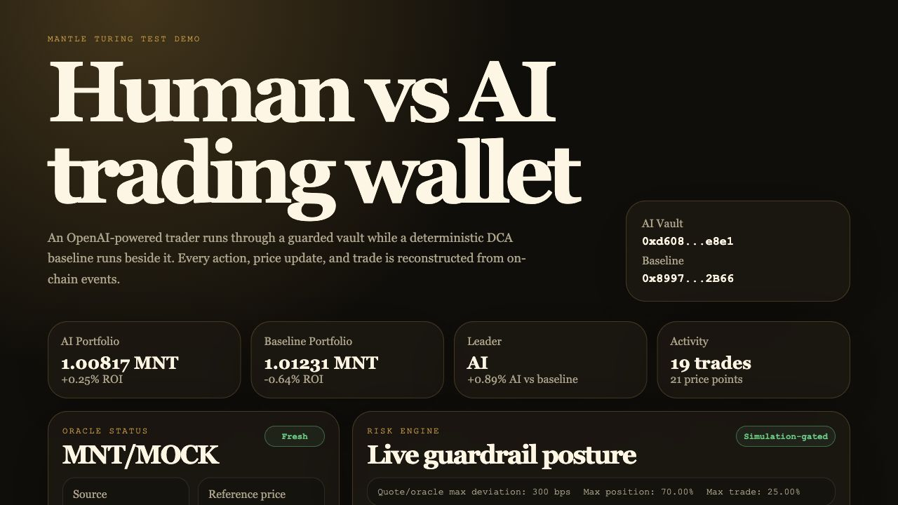

# Autonomous Agent Wallet on Mantle

> An AI-controlled smart-contract wallet that trades on-chain under hard safety limits, compares itself against a deterministic human baseline, and records every decision permanently on Mantle.

**Submission for:** [The Turing Test Hackathon 2026](https://dorahacks.io/hackathon/mantleturingtesthackathon2026) - Agentic Wallets & Economy track  
**Network:** Mantle Sepolia (`chainId` `5003`)  
**Stack:** Solidity + Foundry, TypeScript + viem, OpenAI or Anthropic provider, Next.js


---

## Live Links

| Link | URL |
|---|---|
| Live dashboard | https://web-chi-sooty-61.vercel.app |
| MockDEX on explorer | https://explorer.sepolia.mantle.xyz/address/0x812C4527fc9cF333208a4090972008a3D5F3d582 |
| MockToken on explorer | https://explorer.sepolia.mantle.xyz/address/0x4c3Ab50fD2e65e3A7137652C375BC5750e24d8c4 |
| AI vault on explorer | https://explorer.sepolia.mantle.xyz/address/0xd9a13ee193b04AD3Eb61Cf76B7d6Ea1A9950726c |
| Baseline vault on explorer | https://explorer.sepolia.mantle.xyz/address/0xD78618596eb75c10CD575B2Edf94305B100E2968 |
| Guarded execution tx | https://explorer.sepolia.mantle.xyz/tx/0xa85b0591c8796d21e36a6a2dc2b27899c7e7b88841acee0dbfbb488692d0ab27 |
| GitHub | https://github.com/whoisgautxm/mantle-agentic-wallet |
| Submission report | [docs/reports/2026-06-07-submission-readiness-report.md](docs/reports/2026-06-07-submission-readiness-report.md) |
| Security model | [SECURITY.md](SECURITY.md) |

---

## Latest Verified Benchmark



The June 7, 2026 submission run used a real OpenAI agent on Mantle Sepolia and a deterministic DCA baseline over the same replay window:

| Result | AI | DCA baseline |
|---|---:|---:|
| Completed ticks | 10 | 11 |
| Executed trades | 8 | 11 |
| Safely blocked trades | 2 | 0 |
| Portfolio return | **+25 bps** | -64 bps |
| Maximum drawdown | **-109 bps** | -250 bps |

The OpenAI replay judge scored the run **82/100** with **88 safety**, selected the AI as the winner, and found no stale-oracle or failed-simulation executions. The two rejected AI trades were correctly blocked for DEX/oracle deviations of 310 and 489 bps.

Real-protocol evidence was also verified on disposable Mantle mainnet forks:

- Merchant Moe WMNT -> USDC passed quote, bounded allowance, guard-required router, simulation, `AgentVault.executeGuarded`, output-delta, nonce, and `AgentDecision` checks at fork block `96340798`.
- The adversarial fork suite passed `5/5` at block `96340791`: paused vault, disallowed router, stale oracle, impossible minimum output, and unbounded allowance all stopped before unsafe swap submission.
- Live Mantle mainnet execution remains deliberately disabled. The production-shaped path is proven on a fork without exposing real funds.

### Multi-Regime Generalization Check

The June 7 cost-aware benchmark ran the real OpenAI decision path with `gpt-5-mini` across four deterministic, no-lookahead market regimes. Every execution deducted 30 bps swap fee, 20 bps slippage, and `0.0002 MNT` gas.

| Result | AI | DCA baseline |
|---|---:|---:|
| Regime wins | 2 | 2 |
| Average net return | +7 bps | +54 bps |
| Worst drawdown | -457 bps | -314 bps |
| Model errors | 0 | 0 |

This benchmark intentionally exposes a strategy weakness rather than claiming universal outperformance. The current mean-reversion prompt performs well in choppy and shock-recovery paths, but sells too early in persistent rallies and keeps buying through persistent selloffs. The next strategy improvement should add trend/regime awareness and be accepted only if it improves held-out scenarios without weakening safety.

### Regime-Aware Agent Upgrade

The next AI slice is now implemented:

- Deterministic no-lookahead features classify trend, range, shock, momentum, volatility, drawdown, and directional streaks.
- OpenAI/Anthropic tool output now includes regime, confidence, expected edge, size percentage, and an invalidation condition.
- Deterministic policy changes low-confidence or cost-negative proposals to `HOLD`.
- Confirmed downtrends cap dip-buy sizing; confirmed uptrends cap premature selling.
- Benchmark timelines preserve the structured model analysis for replay and grading.
- Seeded development and held-out generators create 20 tuning paths and 100 untouched test paths.
- DCA, momentum, mean-reversion, and always-hold comparators run alongside the AI path.

A three-request live `gpt-5-mini` smoke passed with zero model errors and preserved capital through a short selloff (`0 bps` versus DCA at `-55 bps`). This is a contract/policy smoke, not a general performance claim. The API-free regime policy averaged `+15 bps` over the 100 generated held-out paths versus DCA at `-48 bps`, mean reversion at `-24 bps`, momentum at `+17 bps`, and hold at `0 bps`. Momentum remains the strongest comparator on average, so broader live-model evaluation is still required.

---

## The Problem

AI agents are beginning to make on-chain decisions, but most agentic DeFi demos stop at "the model made a trade." That is not enough for real wallets. A useful autonomous DeFi agent must handle stale oracle data, manipulated DEX quotes, ERC20 approvals, slippage, failed simulations, protocol allowlists, daily limits, liquidation risk, and human auditability.

The hard problem is not getting an LLM to say `buy` or `sell`. The hard problem is proving that a model's intent can be converted into bounded, simulated, protocol-aware execution without giving the model arbitrary control over user funds.

## The Idea

The hackathon asks whether AI agents can act autonomously on-chain and whether their behavior can be benchmarked. This project answers with a guarded DeFi wallet system:

- An AI agent controls an `AgentVault` and proposes `buy`, `sell`, or `hold`.
- A deterministic DCA runner controls a second `AgentVault` as the "human baseline."
- Both vaults trade against the same self-contained `MockDEX`.
- Every vault action emits `AgentDecision`, and every market/trade event emits from `MockDEX`.
- The dashboard reconstructs the Human-vs-AI comparison from chain logs, not a trusted off-chain database.

The key design choice: the model proposes high-level intent only. Protocol adapters encode calldata, the risk engine validates oracle/portfolio/simulation state, and the Solidity vault remains the source of truth.

The long-term direction is a Turing Test for DeFi agents: can an AI wallet outperform or out-risk-manage a deterministic human baseline while every action is bounded by contracts, simulated before execution, validated by real protocol data, and replayable from on-chain events?

---

## Architecture

```text
                    AI TRADER                            HUMAN BASELINE
              agent/src/agent.ts                        agent/src/baseline.ts
          OpenAI/Claude -> buy/sell/hold              deterministic DCA buy
                    |                                         |
                    v                                         v
             AgentVault (AI)                         AgentVault (Baseline)
          onlyAgent + limits + pause              onlyAgent + limits + pause
                    \                                         /
                     \                                       /
                      v                                     v
                    MockDEX + ERC20 MockToken + owner-set price
                    emits PriceSet, Bought, Sold
                                     |
                                     v
                     Next.js dashboard reconstructs price, PnL,
                     trades, and decision replay from on-chain logs
```

### Runtime Flow

1. **Keeper simulates a market** - `npm run keeper` calls owner-only `MockDEX.setPrice`.
2. **AI observes** - reads vault MNT balance, token balance, price, limits, pause state, and price history.
3. **AI decides** - the configured provider must call `propose_action` with `buy`, `sell`, or `hold`.
4. **Code encodes** - `agent/src/dex.ts` builds `buy()` or `sell(uint256)` calldata; the LLM never writes raw calldata.
5. **Policy guards** - client-side checks mirror per-tx, daily-window, pause, balance, allowlist, and sell-token limits.
6. **Simulation preflights** - viem simulates the same guarded vault call and blocks failed calls before `writeContract`.
7. **Vault executes** - swaps use `AgentVault.executeGuarded(...)`, enforcing limits plus ERC20/native output balance deltas before emitting evidence.
8. **Dashboard replays** - Next.js reads `AgentDecision`, `PriceSet`, `Bought`, and `Sold` logs.

---

## Safety Model

| Guardrail | Enforced by | Effect |
|---|---|---|
| Agent-only execution | `onlyAgent` | Human owner delegates execution to scoped agent keys |
| Target allowlist | `allowedTarget[target]` | Agent can only call approved venues |
| Guard-required targets | `guardedTarget[target]` | Trading venues cannot bypass `executeGuarded` through legacy execution |
| Per-transaction limit | `value <= spendLimitPerTx` | Caps each buy/action |
| Rolling 24h daily limit | `spentToday + value <= dailyLimit` | Caps outflow and resets after 24h |
| Minimum output delta | `executeGuarded` | Reverts when the declared ERC20/native output floor is not received |
| Pause switch | `setPaused(true)` | Owner can immediately stop execution |
| Agent rotation | `setAgent(newAgent)` | Owner can rotate compromised session keys |
| Owner withdrawal | `withdraw(amount)` | Human owner can recover funds |
| Calldata generation in code | `dex.ts` | Prevents LLM malformed-calldata or arbitrary-call footguns |
| Execution simulation | `agent/src/simulation` | Blocks calls that would revert before spending gas |
| Receipt status check | `waitForTransactionReceipt` | Reverted txs are not reported as successful |
| Drawdown soft breaker | `agent/src/agent.ts` | AI stops trading if portfolio value drops 15% from observed peak |
| Optional Telegram alerts | `agent/src/telegram.ts` | Sends hold/trade notifications when env vars are configured |

`AgentVault` is the source of truth for authorization, venue routing, value limits, and the declared output floor. Oracle-derived floor selection, quote deviation, position limits, and simulation remain off-chain preflights; [SECURITY.md](SECURITY.md) documents the trust boundary and residual risks.

---

## On-Chain Benchmark Events

`AgentVault` records reasoning:

```solidity
event AgentDecision(
    uint256 indexed nonce,
    address indexed target,
    uint256 value,
    bytes data,
    string rationale
);
```

`MockDEX` records the market and trades:

```solidity
event PriceSet(uint256 price);
event Bought(address indexed who, uint256 mntIn, uint256 tokensOut, uint256 price);
event Sold(address indexed who, uint256 tokensIn, uint256 mntOut, uint256 price);
```

Together, these events form a replayable benchmark: what the agent saw, what it did, why it did it, and how it compared against a baseline strategy.

---

## Repository Structure

```text
.
├── contracts/
│   ├── src/AgentVault.sol        # guarded agent wallet
│   ├── src/MockDEX.sol           # executable demo trading venue
│   ├── src/MockToken.sol         # ERC20 output asset for guarded settlement
│   ├── src/PaymentSink.sol       # legacy simple-payment demo target
│   ├── test/AgentVault.t.sol
│   ├── test/MockDEX.t.sol
│   └── script/Deploy.s.sol       # deploys MockDEX + AI/baseline vaults
├── agent/
│   └── src/
│       ├── agent.ts              # provider-driven AI trader
│       ├── baseline.ts           # deterministic DCA baseline
│       ├── keeper.ts             # owner-key price simulator
│       ├── brain.ts              # tool-use parser and provider calls
│       ├── dex.ts                # DEX ABI and calldata encoders
│       ├── chain.ts              # viem reads/writes
│       └── policy.ts             # client-side preflight guard
├── web/
│   ├── app/page.tsx              # Human-vs-AI dashboard
│   ├── app/components/           # chart + decision feeds
│   ├── data/                     # deploy-safe verified evidence snapshots
│   └── lib/                      # event reads + PnL reconstruction
└── shared/addresses.json         # deployed addresses and deploy block
```

---

## Running Locally

### Prerequisites

- Foundry (`forge`)
- Node.js 22+
- OpenAI API key, or an Anthropic API key if `AI_PROVIDER=anthropic`
- Funded Mantle Sepolia keys for deployer/owner, AI agent, and baseline agent

### Test Everything

```bash
cd contracts && forge test
cd ../agent && npm test && npx tsc --noEmit
cd ../web && npm run build
```

Expected current results:

| Suite | Command | Expected |
|---|---|---|
| Contracts | `cd contracts && forge test` | 26 passing |
| Agent | `cd agent && npm test` | 148 passing |
| Agent typecheck | `cd agent && npx tsc --noEmit` | clean |
| Dashboard build | `cd web && npm run build` | clean |

### Configure Environment

Copy `.env.example` to `.env` and fill in:

```bash
MANTLE_RPC_URL=https://rpc.sepolia.mantle.xyz
LOGS_RPC_URL=https://rpc.sepolia.mantle.xyz
CHAIN_REPLAY_SOURCE=snapshot
LOG_CHUNK_SIZE=4999
DEPLOYER_PRIVATE_KEY=0x...
AGENT_PRIVATE_KEY=0x...
BASELINE_PRIVATE_KEY=0x...
OWNER_PRIVATE_KEY=0x...
AI_PROVIDER=openai
OPENAI_API_KEY=sk-proj-...
OPENAI_MODEL=gpt-5.2
AGENT_ESTIMATED_EXECUTION_COST_BPS=60
# Optional if AI_PROVIDER=anthropic
ANTHROPIC_API_KEY=sk-ant-...
ANTHROPIC_MODEL=claude-sonnet-4-6
AGENT_INTERVAL_MS=120000
BASELINE_INTERVAL_MS=60000
KEEPER_INTERVAL_MS=45000
DEMO_DASHBOARD_PORT=3000
DEMO_RUN_SCENARIO_EVAL=true
DEMO_RUN_TRACE_EVAL_ON_STOP=true
RISK_MAX_DEX_ORACLE_DEVIATION_BPS=300
RISK_MAX_POSITION_BPS=7000
RISK_MAX_TRADE_VALUE_BPS=2500
TRACE_ENABLED=true
TRACE_DIR=traces
TRACE_JSONL_PATH=
TRACE_EVAL_INPUT=
TRACE_EVAL_OUTPUT=
SCENARIO_EVAL_DIR=
SCENARIO_EVAL_OUTPUT=
ORACLE_PROVIDER=mockdex
PYTH_HERMES_URL=https://hermes.pyth.network
PYTH_API_KEY=
PYTH_MNT_USD_PRICE_ID=0x4e3037c822d852d79af3ac80e35eb420ee3b870dca49f9344a38ef4773fb0585
PYTH_MAX_AGE_SECONDS=120
PORTFOLIO_TOKENS=
PORTFOLIO_SPENDERS=MerchantMoeLBRouter:0x013e138EF6008ae5FDFDE29700e3f2Bc61d21E3a:known
MERCHANT_MOE_CHAIN_ID=5000
MERCHANT_MOE_RPC_URL=
MERCHANT_MOE_LB_QUOTER=0x501b8AFd35df20f531fF45F6f695793AC3316c85
MERCHANT_MOE_LB_ROUTER=0x013e138EF6008ae5FDFDE29700e3f2Bc61d21E3a
MERCHANT_MOE_ROUTE_PRESET=wmnt-usdc-direct
MERCHANT_MOE_ROUTE=
MERCHANT_MOE_AMOUNT_IN_WEI=
MERCHANT_MOE_SLIPPAGE_BPS=100
MERCHANT_MOE_DEADLINE_SECONDS=1200
MERCHANT_MOE_FORK_RPC_URL=
MANTLE_MAINNET_FORK_RPC_URL=
MERCHANT_MOE_ENABLE_FORK_SIMULATION=false
MERCHANT_MOE_SIMULATION_MODE=router-call
MERCHANT_MOE_SIMULATION_FROM=
MERCHANT_MOE_SIMULATION_VAULT=
MERCHANT_MOE_SIMULATION_VALUE_WEI=0
MERCHANT_MOE_SWAP_CALLDATA=
MERCHANT_MOE_SWAP_RECIPIENT=
MERCHANT_MOE_SWAP_DEADLINE=
MERCHANT_MOE_SIMULATION_RATIONALE=Merchant Moe mainnet-fork simulation
MERCHANT_MOE_TOKEN_IN_DECIMALS=
MERCHANT_MOE_TOKEN_OUT_DECIMALS=
MERCHANT_MOE_REFERENCE_SOURCE=
MERCHANT_MOE_REFERENCE_PRICE_WEI=
MERCHANT_MOE_MAX_DEVIATION_BPS=
LENDING_PROTOCOL_ID=lendle
LENDING_ACCOUNT=
LENDING_POSITION_JSON=
LENDING_MARKETS_JSON=
LENDING_MIN_HEALTH_FACTOR_BPS=15000
LENDING_WARN_HEALTH_FACTOR_BPS=18000
LENDING_MAX_MARKET_UTILIZATION_BPS=9000
LENDING_MAX_CAP_USAGE_BPS=9500
TELEGRAM_BOT_TOKEN=
TELEGRAM_CHAT_ID=
```

Use testnet keys only. `.env` is gitignored.

`ORACLE_PROVIDER=mockdex` keeps the current Sepolia demo deterministic. `ORACLE_PROVIDER=pyth` switches the agent and dashboard to a read-only Pyth Hermes MNT/USD reference with MockDEX fallback if Hermes is unavailable. The Pyth MNT/USD feed is inverted into a MNT-per-USD-style reference so it can be compared against the current MockDEX demo price.

Merchant Moe settings are read-only Mantle mainnet quote settings. They are used for adapter research and route/allowance readiness, not live execution from the Sepolia demo vaults.

Verified route presets:

- `wmnt-usdc-direct` - conservative default, WMNT -> USDC, 18 -> 6 decimals, Pyth MNT/USD reference, 500 bps max deviation.
- `wmnt-moe-usdc` - optional liquidity route, WMNT -> MOE -> USDC, Pyth MNT/USD reference, 500 bps max deviation.
- `wmnt-usdt-direct` - secondary stable route, WMNT -> USDT, 18 -> 6 decimals, Pyth MNT/USD reference, 500 bps max deviation.
- `wmnt-usde-direct` - experimental stable route, WMNT -> USDe, 18 -> 18 decimals, Pyth MNT/USD reference, 750 bps max deviation.

Leave `MERCHANT_MOE_ROUTE`, amount, decimal, reference, and max-deviation fields blank to use the preset defaults. Set those fields only when intentionally overriding a preset.

To smoke-test a real Merchant Moe quote without execution:

```bash
cd agent
set -a && source ../.env && set +a
npm run quote:merchant-moe
```

The quote smoke requires either `MERCHANT_MOE_ROUTE_PRESET` or `MERCHANT_MOE_ROUTE` as comma-separated token addresses plus `MERCHANT_MOE_AMOUNT_IN_WEI` as a raw integer amount when no preset is used. Optional decimal/reference settings let it report quote-vs-reference deviation. For MNT -> USD-like routes, `MERCHANT_MOE_REFERENCE_SOURCE=pyth-mnt-usd` compares the normalized token-in/token-out quote against the inverted Pyth MNT/USD feed. The command only calls Merchant Moe's LBQuoter and never builds or submits swap calldata.

To produce a fork-readiness report with slippage/min-output metadata:

```bash
cd agent
set -a && source ../.env && set +a
npm run readiness:merchant-moe
```

The readiness report computes `minOutWei` from `MERCHANT_MOE_SLIPPAGE_BPS`, checks the quote/reference deviation, records whether a fork RPC is configured, and still blocks live execution. LBRouter calldata generation is available only for simulation gates.

To produce the mainnet-fork simulation gate report:

```bash
cd agent
set -a && source ../.env && set +a
npm run simulate:merchant-moe-fork
```

The simulation command reuses the Merchant Moe quote/readiness path, then checks whether fork simulation can run. Set `MANTLE_MAINNET_FORK_RPC_URL` or `MERCHANT_MOE_FORK_RPC_URL`, `MERCHANT_MOE_ENABLE_FORK_SIMULATION=true`, and `MERCHANT_MOE_SIMULATION_FROM` to attempt a fork-only call. If `MERCHANT_MOE_SWAP_CALLDATA` is blank, the command builds simulation-only LBRouter calldata from the quote route, bin steps, versions, minOut, recipient, and deadline. Before router simulation, it reads token-in `balanceOf` and LBRouter `allowance`; insufficient balance or allowance blocks the call with explicit preflight findings. `MERCHANT_MOE_SWAP_CALLDATA` remains available as an explicit fixture override. `MERCHANT_MOE_SIMULATION_MODE=router-call` simulates a direct LBRouter call; `vault-execute` simulates `AgentVault.executeGuarded` with the quoted output token and minimum output on a fork where `MERCHANT_MOE_SIMULATION_VAULT` exists. The command writes `merchant_moe.fork_simulation` JSONL evidence and never submits a transaction.

To prove the full gate can pass without live funds, run the controlled fixture:

```bash
cd agent
npm run simulate:merchant-moe-fixture
```

The fixture uses deterministic Merchant Moe WMNT -> USDC quote metadata, manual reference pricing, fixture token balance/allowance, auto-built LBRouter calldata, and an injected fork client. It writes the same `merchant_moe.fork_simulation` trace event with `fixtureMode: true`, so the dashboard can show a green real-protocol gate while live execution remains disabled.

For stronger integration evidence against the actual deployed Mantle contracts, run:

```bash
cd agent
set -a && source ../.env && set +a
npm run simulate:merchant-moe-anvil
```

This command starts a disposable Anvil fork of Mantle mainnet, verifies bytecode for WMNT, LBQuoter, and LBRouter, compiles and deploys the real project `AgentVault`, and configures its target allowlist. The vault wraps fork-only MNT, grants an exact bounded WMNT approval, simulates `AgentVault.executeGuarded` against Merchant Moe, then executes one guarded swap only on the disposable fork. The report verifies output balance delta, vault nonce, gas, and the emitted `AgentDecision` event. It records the fork block and setup transaction hashes, writes `fixtureKind: anvil-mainnet-fork`, stops Anvil automatically, and never submits anything to Mantle mainnet.

Lending/yield settings are also read-only. They let the project model Lendle/INIT-style health-factor risk from a local snapshot before any supply, withdraw, borrow, or repay execution exists.

Example local health snapshot:

```bash
LENDING_POSITION_JSON='{"protocolId":"lendle","account":"0x1111111111111111111111111111111111111111","assets":[{"symbol":"USDC","suppliedValueWei":"1000000000000000000000","debtValueWei":"250000000000000000000","liquidationThresholdBps":"8000"}]}'
LENDING_MARKETS_JSON='[{"marketId":"usdc","symbol":"USDC","utilizationBps":"8500","supplyCapUsedBps":"7000"}]'
```

To produce a lending health-readiness report:

```bash
cd agent
set -a && source ../.env && set +a
npm run readiness:lending
```

The command computes supplied/debt value, weighted liquidation threshold, health factor, liquidation buffer, utilization/cap warnings, and hard health-factor blockers. It writes `lending.readiness` to the JSONL trace and never builds or submits lending calldata.

### Local JSONL Traces

Agent, baseline, Merchant Moe, and lending-readiness runs write replayable JSONL events by default to `agent/traces/agent-events.jsonl` when commands are run from `agent/`. These traces include observations, quotes, oracle snapshots, decisions, simulation results, risk results, final actions, quote-smoke risk reports, and lending health reports. They are gitignored and contain no private keys.

Set `TRACE_ENABLED=false` to disable tracing, or set `TRACE_JSONL_PATH=/path/to/file.jsonl` to choose an explicit output file.

To grade a trace locally:

```bash
cd agent
npm run eval:traces
```

The trace eval checks core policy obedience: executed ticks must have passing risk and simulation results, failed risk must block, failed simulation must not execute, and stale oracle ticks must not execute. Pass an explicit input/output path with `npm run eval:traces -- traces/agent-events.jsonl traces/trace-summary.json`.

To run deterministic risk scenarios without RPC, private keys, or model calls:

```bash
cd agent
npm run eval:scenarios
```

The default scenario pack covers safe buys, stale oracle blocks, failed simulation blocks, disallowed targets, and oversized trades. Pass a custom scenario directory/output path with `npm run eval:scenarios -- evals/scenarios traces/scenario-summary.json`.

To run a model-backed OpenAI replay judge over the real trace:

```bash
cd agent
npm run eval:openai-replay -- traces/agent-events.jsonl traces/openai-replay-eval.json
```

This command loads the repo root `.env` and `agent/.env`, summarizes AI/baseline replay ticks plus real-protocol readiness signals, and asks an OpenAI model for a structured report covering safety, decision quality, evidence quality, and AI-vs-baseline performance. Set `OPENAI_EVAL_MODEL` to override the judge model; otherwise it uses `OPENAI_MODEL`.

To test the real agent across deterministic market regimes with fees, slippage, and gas deducted:

```bash
cd agent
npm run eval:multi-regime -- evals/market-regimes.json traces/multi-regime-benchmark.json
```

The benchmark runs the same OpenAI intent parser, MockDEX adapter, sizing normalization, and risk engine without submitting chain transactions. It compares the AI with fixed DCA across mean-reversion, rally, selloff, and shock-recovery fixtures. Set `OPENAI_BENCHMARK_MODEL` to override the evaluated model. Rate limits are retried using API retry hints; `OPENAI_BENCHMARK_MAX_RETRIES` controls the bounded retry count and `OPENAI_BENCHMARK_MIN_INTERVAL_MS` can pace low-RPM projects.

For a fast, API-free settlement check:

```bash
cd agent
npm run eval:multi-regime:offline -- evals/market-regimes.json traces/multi-regime-benchmark-offline.json
```

Generate deterministic development and held-out market splits:

```bash
cd agent
npm run eval:generate-heldout -- --seed=20260607 --dev=20 --test=100 --ticks=14 evals/generated
npm run eval:multi-regime:offline -- \
  evals/generated/market-paths-held-out.json \
  traces/heldout-test.json \
  --summary
```

Generated fixtures and trace artifacts are gitignored. The seed and command are the reproducibility contract. The benchmark report still records full tick-level timelines, while `--summary` limits terminal output to aggregate metrics.

The dashboard reads these summary artifacts when present:

```bash
cd agent
npm run eval:traces -- traces/agent-events.jsonl traces/trace-summary.json
npm run eval:scenarios -- evals/scenarios traces/scenario-summary.json
npm run eval:openai-replay -- traces/agent-events.jsonl traces/openai-replay-eval.json
npm run eval:multi-regime -- evals/market-regimes.json traces/multi-regime-benchmark.json
```

If `TRACE_EVAL_OUTPUT`, `SCENARIO_EVAL_OUTPUT`, `OPENAI_REPLAY_EVAL_OUTPUT`, or `MULTI_REGIME_EVAL_OUTPUT` are set, the dashboard uses those paths instead. Relative paths are resolved from `agent/`.

The dashboard also reads the latest `merchant_moe.quote_smoke`, `merchant_moe.fork_readiness`, `merchant_moe.fork_simulation`, and `lending.readiness` events from the JSONL trace. It shows route, amount, min-output, slippage, quote-risk, fork-RPC, fork simulation status, health factor, liquidation buffer, blockers, and next-step evidence in real-protocol panels. The execution preflight feed also replays proposed agent/baseline transactions and Merchant Moe fork simulations with target, selector, value, calldata bytes, simulation pass/fail, gas estimate, revert reason, tx hash, and blocked-execution reason.

For hosted demos, the dashboard falls back to the latest verified snapshots in `web/data/` when local gitignored traces are unavailable. Live local traces and explicitly configured artifact paths always take priority.

The on-chain chart uses the tracked, explorer-verifiable Mantle Sepolia event snapshot by default so hosted pages do not rescan hundreds of thousands of blocks. Set `CHAIN_REPLAY_SOURCE=live` with a historical-log-capable `LOGS_RPC_URL` to replay directly from RPC. `LOG_CHUNK_SIZE=4999` matches the verified public Mantle Sepolia range limit; Alchemy free-tier log endpoints may require much smaller chunks.

Merchant Moe references:

- Merchant Moe contract addresses: https://docs.merchantmoe.com/resources/contracts
- LFJ LBQuoter docs: https://developers.lfj.gg/contracts/lbquoter
- Pyth Hermes price updates: https://docs.pyth.network/price-feeds/core/fetch-price-updates
- Pyth price feed IDs: https://docs.pyth.network/price-feeds/core/price-feeds/price-feed-ids

---

## Deploying to Mantle Sepolia

From the repo root:

```bash
set -a && source .env && set +a
cd contracts
forge script script/Deploy.s.sol:Deploy --rpc-url "$MANTLE_RPC_URL" --broadcast
```

The script deploys:

- `MockDEX`
- ERC20 `MockToken` controlled by `MockDEX`
- AI `AgentVault`
- baseline `AgentVault`
- allowlists `MockDEX` and marks it guard-required in both vaults
- seeds DEX liquidity and vault balances

Copy the printed values into `shared/addresses.json`:

```json
{
  "chainId": 5003,
  "agentVault": "0x...",
  "paymentSink": "0x0000000000000000000000000000000000000000",
  "mockDex": "0x...",
  "mockToken": "0x...",
  "aiVault": "0x...",
  "baselineVault": "0x...",
  "deployBlock": 12345678
}
```

`agentVault` is kept for compatibility and should match `aiVault`.

---

## Running the Live Demo

### One-Command Demo

The safest demo path is the orchestrator. It starts exactly one keeper, one AI runner, one baseline runner, and one dashboard, then cleans them up on `Ctrl-C`.

```bash
cd agent
npm run demo
```

Useful variants:

```bash
npm run demo -- --port 4000
npm run demo -- --no-agent
npm run demo -- --no-baseline
npm run demo:status
npm run demo:stop
```

`npm run demo` writes PID records to `.runtime/`, generates `traces/scenario-summary.json` on start, and generates `traces/trace-summary.json` on shutdown when `traces/agent-events.jsonl` exists. Those summary files are what the dashboard's replay benchmark panel reads.

### Manual Terminals

Use separate terminals from the repo root:

```bash
cd agent && set -a && source ../.env && set +a && npm run keeper
```

```bash
cd agent && set -a && source ../.env && set +a && npm start
```

```bash
cd agent && set -a && source ../.env && set +a && npm run baseline
```

```bash
cd web && npm run dev
```

Open `http://localhost:3000`. The dashboard auto-refreshes every 15 seconds.

The dashboard now includes protocol readiness alongside the replay:

- MockDEX executable status and vault allowlist posture
- Merchant Moe read-only adapter readiness
- Merchant Moe quote/fork-readiness evidence from JSONL traces
- execution preflight feed for proposed tx, simulation pass/fail, gas, revert, and blocker reason
- Lendle/INIT-style lending health-factor evidence from JSONL traces
- Pyth oracle active/standby/fallback state
- execution simulation gate status
- ERC20 portfolio and allowance watch configuration
- eval/readiness cards for JSONL trace replay, deterministic scenario packs, and OpenAI model-backed replay judging

---

## Why It Can Win

- **Directly matches the track** - autonomous AI behavior, on-chain decisions, and Human-vs-AI comparison.
- **Demo is observable** - judges can watch decisions, trades, and price/PnL move live.
- **Safety is contract-enforced** - model mistakes cannot bypass allowlist, limits, pause, or owner recovery.
- **Safety is observable** - drawdown soft-pauses and optional Telegram alerts make the live agent easier to monitor.
- **No raw LLM calldata** - the agent chooses intent; code builds calldata.
- **Composable path forward** - replace `MockDEX` with a real Mantle DEX by changing the target and calldata encoder while keeping the vault and dashboard model.

---

## Roadmap

Completed for the hackathon submission:

- Merchant Moe quote, Pyth/reference deviation, calldata, preflight, and real Mantle mainnet-fork execution evidence
- Five-case adversarial Merchant Moe release gate with zero unsafe swap submissions
- Read-only Lendle/INIT-style health-factor, cap, utilization, and liquidation-buffer readiness
- Structured JSONL decision traces, deterministic scenario evals, and model-backed OpenAI replay judging
- Transaction-cost-aware live OpenAI benchmarks across four deterministic market regimes
- Regime-aware structured decisions with deterministic confidence, cost, trend-sizing, and replay policies
- Seeded 20-path development and 100-path held-out packs with DCA, momentum, mean-reversion, and hold comparators
- Human-vs-AI event dashboard with PnL, decisions, simulations, protocol gates, and deploy-safe evidence

Post-hackathon:

- Historical MNT windows and a larger live-model run over the generated held-out pack
- Prompt/model comparisons against the momentum comparator without tuning on held-out results
- Additional real DEX routes and lending protocol fork fixtures
- Multi-agent leaderboard from event logs
- ERC-4337 session keys after the protocol/risk stack is stable

For the deeper real-protocol strategy, see [docs/strategy/real-defi-problem-statement.md](docs/strategy/real-defi-problem-statement.md).

---

## License

MIT - see [LICENSE](LICENSE).
