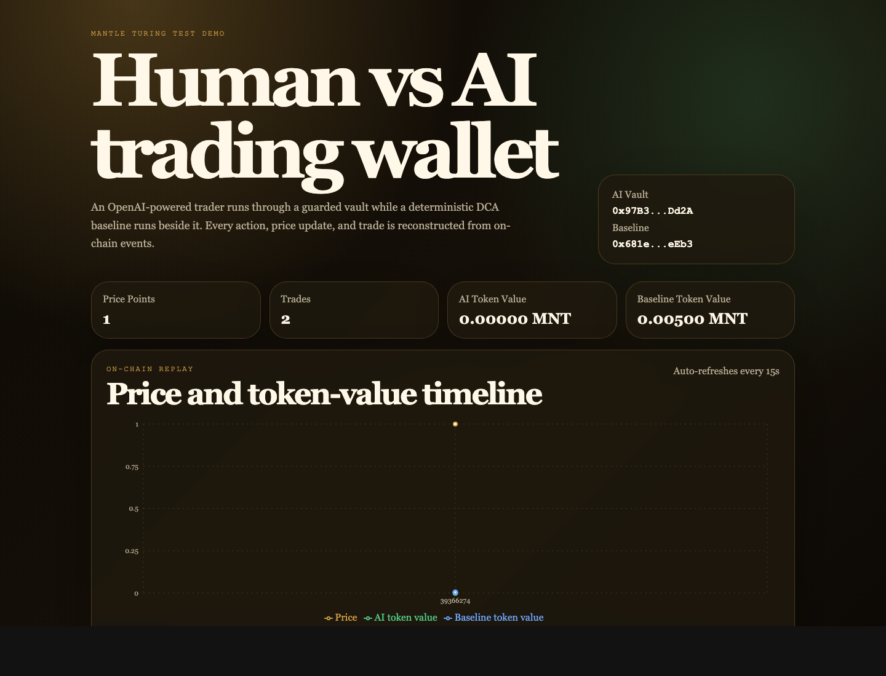
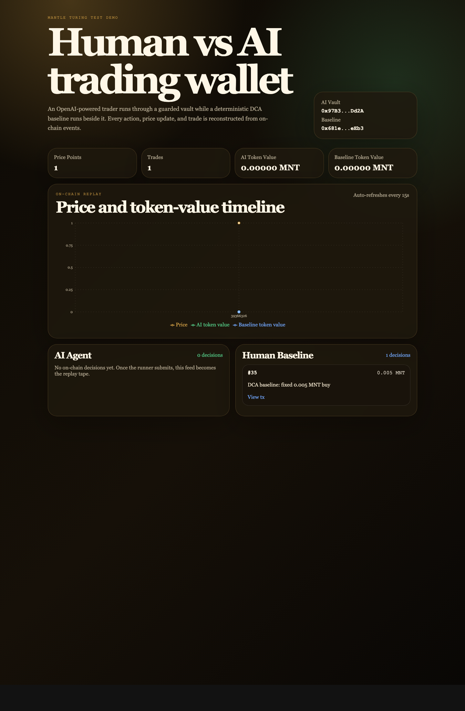

# Mantle Human vs AI Trading Wallet Progress Report

Generated: 2026-06-01 06:59 IST

## Executive Summary

The backend demo loop is now implemented and running on Mantle Sepolia with a guarded AI trading vault, a deterministic DCA baseline vault, a MockDEX price simulator, and a dashboard that reconstructs the comparison from on-chain events.

The AI provider has been migrated from Anthropic-only usage to OpenAI-first configuration. The current `.env` uses OpenAI for decisions and the Alchemy Mantle Sepolia RPC for live chain access. Secrets and private keys remain local and are not committed.

## Preview Screenshots

Dashboard hero and chart preview:

Full dashboard with Human-vs-AI feeds:

## What Has Been Built

- Solidity guarded wallet: `AgentVault` enforces allowed targets, per-transaction spend limits, daily spend limits, pause control, non-reentrancy, and on-chain decision events.
- Mock trading venue: `MockDEX` supports simulated price updates plus buy/sell events for replayable demo trading.
- AI trading runner: the agent reads vault state, DEX price, token balance, limits, and price history, then asks the configured AI provider for a `buy`, `sell`, or `hold` decision.
- OpenAI provider support: `AI_PROVIDER=openai` and `OPENAI_MODEL=gpt-5.2` are now supported, while Anthropic remains available as an optional provider.
- Human baseline runner: `baseline.ts` executes a deterministic DCA strategy for the Human-vs-AI comparison.
- Keeper runner: `keeper.ts` simulates price movement by writing `PriceSet` events to the MockDEX.
- Dashboard: the Next.js UI reads `PriceSet`, `Bought`, `Sold`, and `AgentDecision` logs, then renders price/PnL charts and separate AI vs baseline feeds.
- RPC hardening: chain reads now retry rate-limit failures, dashboard event scans are chunked for Alchemy limits, and dashboard fetches avoid unnecessary parallel RPC bursts.

## Current Mantle Sepolia Deployment

| Item | Value |
| --- | --- |
| Chain | Mantle Sepolia |
| Chain ID | `5003` |
| MockDEX | `0xe94AA9aEC1b3b46996a5c5ec7Fd8117b8518D8A1` |
| AI vault | `0x97B33664270F59D3129782A3514aDF53F2bcDd2A` |
| Baseline vault | `0x681e9d5E0809859c0b94618840DcaADc92F5eEb3` |
| Deploy block | `39349466` |

## Demo Loop Behavior

1. The keeper updates the MockDEX price on Mantle Sepolia.
2. The OpenAI agent reads the current vault state and recent prices.
3. The AI either holds off-chain or submits a guarded on-chain vault execution for buy/sell decisions.
4. The baseline runner submits fixed-size DCA buys.
5. The dashboard reconstructs the replay from contract events rather than a trusted database.

The latest screenshot shows a recent baseline DCA decision in the Human Baseline feed. The AI feed can be empty even while the AI runner is active because current OpenAI decisions have been `hold`; holds are logged by the local runner but are not submitted as on-chain `AgentDecision` events.

## Verification Completed

- `agent/npm test`: 24 tests passed.
- `agent/npx tsc --noEmit`: passed.
- `web/npm run build`: passed.
- Live Mantle Sepolia read through Alchemy: deployed vaults and DEX were reachable.
- Dashboard production preview: `http://localhost:3004` returned HTTP `200`.
- Screenshot capture: generated from the production dashboard preview using local headless Brave.

## Commit Timeline

| Commit | Summary |
| --- | --- |
| `04b91f7` | Retry keeper price reads to reduce Alchemy rate-limit failures |
| `1ddec14` | Deploy Mantle Sepolia demo addresses and harden RPC/event fetching |
| `ca65bf8` | Add OpenAI provider support |
| `510a73c` | Add agent breaker and alerts |
| `c9705eb` | Update README for DEX benchmark demo |
| `fc7e936` | Add Human-vs-AI demo dashboard |
| `8599b64` | Add DEX trading backend |

## Remaining Recommendations

- Add a single `demo:run` orchestrator script so only one keeper, one baseline, one AI runner, and one dashboard process run at a time.
- Consider emitting explicit on-chain `hold` decision events if judges need to see AI non-action in the dashboard feed.
- Add a small "event window" control to the dashboard so demo operators can widen or narrow the log lookback without changing environment variables.
- Add explorer links for vault addresses and latest transaction hashes directly in the hero cards.
- Prepare a final judging mode with stable seeded intervals and a short script for resetting the demo state between presentations.
