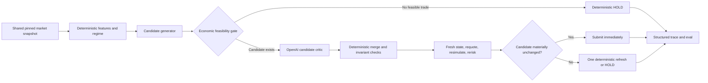

# AI Missed Opportunities: Root-Cause Diagnosis and Repair Plan

Date: 2026-06-07

## Executive conclusion

The live AI did not lose because the underlying ensemble strategy is weak. It lost because the production composition and benchmark turned a promising strategy into an inactive, uneconomic runner.

The strongest evidence is:

- The deterministic ensemble performs well in held-out simulations, beating DCA on all three documented seeds.
- In the second live run, the deterministic prior produced 11 buy candidates, but the model suppressed 9 of them with `HOLD`.
- The remaining 2 buy candidates became stale during inference and were blocked.
- Every blocked order was also economically too small for observed gas, so simply relaxing the freshness guard would have caused negative-expectation trades.
- The AI and baseline did not observe the same blocks, did not start from equivalent portfolios, and did not pass through the same execution gates. The current live comparison is therefore useful as an integration smoke test, but not yet a valid strategy contest.

The correct objective is not "make the AI trade more." It is:

> Make the AI approve high-quality, economically feasible opportunities promptly while preserving deterministic safety and measuring its performance against fair, identical baselines.

No engineering change can guarantee that the AI beats every human or baseline in every market. The target should be a repeatable, statistically supported advantage over defined comparators under identical observations, capital, costs, and execution rules.

## Evidence from the two live runs

| Metric | Run 1 | Run 2 |
| --- | ---: | ---: |
| AI model | `gpt-5-mini` | `gpt-4.1-mini` fallback |
| AI ticks | 18 | 32 |
| AI executions | 0 | 0 |
| AI holds | 14 | 30 |
| AI stale blocks | 4 | 2 |
| AI gross/net return | 0% / 0% | 0% / 0% |
| Average AI decision latency | 16.105 s | 2.564 s |
| Baseline executions | 18 | 25 |
| Baseline gross return | +1.0341% | +2.3651% |
| Baseline gas-adjusted return | -8.136% | -10.8957% |
| Market move | Not used as a synchronized benchmark | +7.8767% |
| Deterministic prior buy candidates | 4 | 11 |
| Prior buys suppressed by model `HOLD` | 0 | 9 |
| Prior buys blocked after alignment | 4 stale | 2 stale |

The baseline appeared to win on gross portfolio value, but it lost heavily after gas. That distinction matters: the current OpenAI replay judge uses gross portfolio values and therefore praised activity that was economically destructive.

## Ranked root causes

### P0: The hybrid policy is an intersection, not an ensemble

The live merger in `agent/src/brain.ts` has two asymmetric vetoes:

1. A model `HOLD` immediately wins, even when the deterministic prior wants to trade.
2. A prior `HOLD` also vetoes a model trade.

When they agree, action size and expected edge use the minimum of the two estimates. The least confident component therefore controls both whether the trade exists and whether it can pass the cost gate.

This creates a large dead zone:

```text
model BUY + prior HOLD -> HOLD
model HOLD + prior BUY -> HOLD
model BUY + prior BUY  -> BUY at minimum size and minimum edge
```

In run 2, this design suppressed 9 of 11 deterministic buy candidates. It is the largest direct source of missed opportunities.

### P0: The prompt encouraged an impossible portfolio narrative

The prompt says:

> In sustained uptrends, avoid repeatedly selling the winning position; prefer holding or adding modestly.

The statement is not conditional on owning the token. In run 2, the model repeatedly justified `HOLD` as preserving a winning position even though the token balance was zero. With a cash-only portfolio, `HOLD` preserved cash and missed the uptrend.

This was not merely a weak market forecast. It was a state-grounding error that should have been rejected deterministically.

### P0: Inference occurs inside the quote-to-submit critical path

The runner reads state, asks the model, builds and simulates a transaction, runs risk checks, and only then checks block drift. It does not refresh state, requote, or resimulate.

Consequences:

- Run 1's 16-second average inference latency was enough to make all four actionable decisions stale.
- Run 2 was faster, but both actionable decisions still drifted by 4-5 blocks against a limit of 3.
- A stale candidate is discarded rather than refreshed once.
- The next loop starts from scratch and pays for another model call.

The safety guard is doing its job. The pipeline around it is not designed for a latency-bearing model.

### P0: Proposed trades were economically infeasible

Observed AI simulation gas was roughly `164k-168k`, with gas cost near `0.0082-0.00843 MNT` per execution.

The blocked orders were only `0.01-0.05 MNT`. Their estimated total execution cost was approximately `1,749-8,420 bps`, while their expected edge was only `120-200 bps`.

Their calculated break-even notionals were approximately `0.91-8.28 MNT`, but the per-transaction limit was `0.1 MNT`.

Therefore:

- Refreshing and executing these exact orders would not improve performance.
- The agent should reject economically impossible opportunities before calling the model.
- Tiny testnet trades should not be used to claim net trading profitability.

### P1: The benchmark does not isolate strategy quality

AI, baseline, and keeper run on independent timers. Each timer schedules its next tick after its current work completes, so slower inference changes both tick count and observed blocks.

The runners also:

- observe different block snapshots;
- begin from different portfolio exposures in the recorded runs;
- use different freshness and dynamic-cost gates;
- incur different decision latency;
- use a DCA amount whose gas can exceed its notional.

The current result answers "which complete pipeline produced a higher gross value during this window?" It does not answer "which strategy made better decisions from the same information?"

### P1: Model fallback changed behavior without a quality gate

Run 1 exhausted the `gpt-5-mini` daily request allowance. Run 2 used `gpt-4.1-mini`, which was much faster but produced materially worse state-grounded reasoning.

A weaker fallback model should not silently inherit transaction authority. A fallback must either:

- have passed the same trading-specific eval threshold; or
- reduce the system to deterministic ensemble mode and record that degraded mode explicitly.

### P1: The replay judge scores the wrong outcome

The replay evaluator calculates ROI from gross portfolio values and omits cumulative gas from runner statistics. Its model prompt asks an LLM to select the winner from those values.

This produced a misleading result:

- It praised the baseline's positive gross ROI.
- It ignored the baseline's deeply negative gas-adjusted ROI.
- It labeled AI inactivity as a critical safety issue, although the AI made no unsafe execution.

Safety, profitability, and semantic decision quality must be separate dimensions. The deterministic evaluator should decide numeric winners; the model judge should grade rationale grounding and evidence quality.

### P2: The model controls fields that deterministic code can calculate better

The model currently proposes:

- action;
- amount;
- size percentage;
- expected edge;
- confidence;
- rationale.

Amount limits, action feasibility, execution cost, and much of edge calibration are deterministic. Asking the model for them increases variance and lets a free-form low edge or tiny amount make a valid candidate fail downstream.

### P2: The system calls the model on every tick

Run 2 made 32 model decisions for only 11 deterministic trade candidates. Run 1 made 18 calls for 4 candidates.

This:

- consumes quota;
- increases latency;
- increases the chance of inconsistent holds;
- spends model reasoning on ticks deterministic logic already classified as no-action.

## Counterfactual diagnosis

### What would happen if only freshness were relaxed?

The six blocked buys would execute, but their cost estimates were far above expected edge. This likely converts safe inactivity into negative net returns.

Conclusion: do not weaken the stale-state guard by itself.

### What would happen if the model were removed?

The deterministic prior would have produced 4 buy candidates in run 1 and 11 in run 2. Offline, that strategy already beats DCA across the documented held-out seeds.

However, live orders would still need economic sizing, shared snapshots, refresh/revalidation, and realistic gas treatment.

Conclusion: the deterministic strategy is a good candidate generator, not yet a complete live execution system.

### What would happen if the prompt alone were fixed?

It should remove the false "preserve a winning position" rationale, but the intersection merger, stale pipeline, and infeasible trade sizing would remain.

Conclusion: prompt repair is necessary but insufficient.

## Target architecture

The recommended architecture makes the model a constrained decision critic rather than a free-form transaction author.



### Stage 1: Deterministic candidate generation

The ensemble should emit zero or more fully specified candidates:

```ts
type TradeCandidate = {
  id: string;
  action: "buy" | "sell";
  amountWei: bigint;
  regime: MarketRegime;
  confidence: number;
  conservativeEdgeBps: number;
  estimatedTotalCostBps: number;
  evidence: string[];
};
```

Candidates must already satisfy:

- inventory and balance constraints;
- vault limits;
- minimum confidence;
- conservative edge above total cost plus buffer;
- minimum economic notional;
- supported protocol route;
- preliminary oracle and quote checks.

If no candidate passes, record an explicit deterministic `HOLD` and do not call OpenAI.

### Stage 2: OpenAI candidate critic

The model receives state, features, and a small list of feasible candidates. It does not invent an amount or expected edge.

Use strict Structured Outputs:

```ts
type CandidateAssessment = {
  candidateId: string;
  verdict: "approve" | "veto";
  vetoCode:
    | "none"
    | "state_inconsistency"
    | "regime_conflict"
    | "evidence_insufficient"
    | "tail_risk";
  confidence: number;
  evidence: string[];
  rationale: string;
};
```

The model may veto only with a supported code and evidence. Generic caution such as "preserve position" is not a valid veto.

For the hackathon demo, a strong alternative is `ensemble-direct + AI-audit`: the ensemble acts while the model explains, identifies contextual risk, and can veto only for a narrow safety condition. This preserves a genuine AI role without letting prose override basic arithmetic.

### Stage 3: Deterministic merge

The merger should:

- reject assessments that refer to an impossible portfolio state;
- reject unsupported veto codes;
- preserve deterministic amount and edge;
- choose the highest utility approved candidate;
- record candidate, assessment, and final decision separately.

There must be no unconditional `model HOLD -> final HOLD` path.

### Stage 4: Post-inference revalidation

After the model returns:

1. Read a fresh pinned block and oracle state.
2. Recompute features and the deterministic candidate.
3. Requote and rebuild calldata.
4. Resimulate.
5. Rerun risk and cost gates.
6. Compare action, regime, price drift, and expected utility with the approved candidate.
7. Submit immediately if materially unchanged.
8. If stale but equivalent, allow one deterministic refresh without a second model call.
9. Hold if the candidate changed materially.

Block drift should remain telemetry, but transaction validity should be based primarily on quote age, oracle/price drift, deadline, and a fresh successful simulation.

## Economic execution design

### Gate before inference

Estimate rolling gas cost before the model call. Compute:

```text
minimumEconomicNotional =
  gasCost * 10,000 /
  (conservativeEdgeBps - feeBps - slippageBps - safetyBufferBps)
```

If the denominator is non-positive, or minimum notional exceeds available capital or the per-transaction cap, return:

```text
HOLD: ECONOMICALLY_INFEASIBLE
```

This should not consume an OpenAI request.

### Separate integration gas from strategy scoring

Mantle testnet transaction gas is useful for proving the execution path. It is not a good environment for claiming production strategy profitability with tiny vault balances.

Report two scorecards:

1. **Protocol integration:** real RPC, quote, simulation, risk, submission, receipt, observed testnet gas.
2. **Strategy performance:** shared replay/fork prices with a declared mainnet-like cost model and identical costs for every strategy.

Never hide observed gas, but do not let faucet-sized test transactions decide the strategy contest.

### Reduce execution overhead

After correctness is fixed:

- store a compact decision ID on-chain instead of a long rationale string;
- retain full rationale and evidence in JSONL traces;
- use a slower cadence unless regime or candidate changes;
- avoid repeated tiny transactions;
- consider batching only if the protocol and vault safety model permit it.

## Prompt and model repair

### Required state invariants

The prompt and deterministic validator must state:

- `HOLD` means no position change.
- If `tokenBalance == 0`, holding preserves cash, not a winning token position.
- `SELL` is impossible when `tokenBalance == 0`.
- In an uptrend with cash and a feasible buy candidate, explicitly evaluate that buy.
- Do not describe exposure that is absent from the supplied state.
- Economic infeasibility is a valid hold reason; generic conservatism is not.

### Few-shot cases

Add examples for:

- cash-only portfolio in a confirmed uptrend;
- token inventory in a confirmed downtrend;
- range with no sufficient edge after costs;
- strong signal whose minimum economic notional exceeds the vault cap;
- stale candidate that remains equivalent after one refresh;
- candidate whose regime changes during revalidation.

### Model policy

- Use a snapshot-pinned model in benchmark runs.
- Do not silently replace it with an unevaluated fallback.
- Call the model only for feasible candidates or meaningful regime transitions.
- Cache a recent assessment for an unchanged candidate/state bucket.
- On quota failure, use explicit `deterministic_degraded_mode`.
- Evaluate a current high-quality model and a current mini model on the same candidate-assessment dataset before choosing the live default.

As of this report, OpenAI's current model catalog recommends its flagship model for complex reasoning and a current mini variant where latency and cost matter. The project should select by its own trading eval, not by model name or size alone.

## Fair Human-vs-AI benchmark

Replace independent loops with a single coordinator:

```text
keeper update
-> wait for confirmed block
-> create one shared pinned snapshot
-> give the same snapshot to every strategy
-> collect decisions
-> pass all decisions through the same execution policy
-> settle
-> mark every portfolio at the same price and block
```

### Required controls

- Fresh vaults or reset fixtures for every run.
- Identical starting capital and zero token inventory.
- Same block, price history, oracle, route, and quote source.
- Same risk, freshness, simulation, and cost gates.
- Same action and capital budget.
- Same cost model.
- Fixed run ID, model snapshot, configuration hash, and scenario seed.
- Graceful shutdown that completes the current tick and emits one terminal trace.

### Comparators

Use more than one "human" policy:

- hold cash;
- buy and hold;
- economically sized DCA;
- simple momentum;
- the deterministic ensemble without model assessment;
- AI-assisted ensemble.

The most important comparison is:

```text
deterministic ensemble vs AI-assisted ensemble
```

That isolates the incremental value of the OpenAI reasoning layer.

## Evaluation redesign

OpenAI's evaluation guidance recommends task-specific evals, continuous evaluation, automated scoring where possible, comprehensive logging, and calibration of automated graders with human feedback. The project already has strong trace foundations; the next step is to make each grade correspond to one exact failure mode.

### Deterministic performance score

Code, not an LLM, should calculate:

- gas-adjusted net ROI;
- return versus buy-and-hold;
- maximum drawdown;
- turnover and total cost;
- execution/revert/stale rate;
- opportunity capture;
- regret versus the best feasible candidate;
- entry lag after a confirmed regime transition;
- candidate approval precision and recall.

The numeric winner should be deterministic.

### Model semantic score

The OpenAI judge should grade only:

- state grounding;
- rationale-feature consistency;
- evidence sufficiency;
- appropriate veto code;
- whether the chosen candidate follows the supplied constraints.

Prefer per-case pass/fail or pairwise comparison over a vague overall score.

### New semantic regression rules

Add deterministic failures for:

- `POSITION_HALLUCINATION`: rationale claims token exposure when balance is zero.
- `IMPOSSIBLE_SELL`: model approves sell with zero inventory.
- `UNSUPPORTED_VETO`: veto has no allowed code or evidence.
- `MISSED_FEASIBLE_TREND_ENTRY`: model vetoes a feasible trend candidate without a valid reason.
- `COST_BLIND_APPROVAL`: model approves a candidate marked economically infeasible.
- `STALE_WITHOUT_REFRESH`: equivalent candidate is discarded without the allowed refresh.
- `UNEQUAL_BENCHMARK_SNAPSHOT`: compared strategies did not share the same block.

### Dataset construction

Mine the existing JSONL traces into labeled cases:

- all 15 deterministic buy candidates from the two runs;
- the 9 run-2 candidates suppressed by model holds;
- the 6 stale blocked decisions;
- the 12 portfolio-state hallucination rationales;
- cost-infeasible orders;
- successful no-trade cases in downtrend/range/shock regimes.

Manually label a small gold set first, then continuously add live failures.

## Acceptance gates

The next live contest should not start until these gates pass.

### Safety and correctness

- Zero executions after failed simulation or failed risk checks.
- Zero inventory/state hallucinations in the gold eval set.
- Zero unsupported model vetoes.
- At least 95% trace completeness, with exactly one terminal action per started tick.

### Liveness and execution

- At least 80% of model-approved, economically feasible candidates either execute or end with a material revalidation reason.
- Median candidate-to-submit latency remains within the configured quote validity window.
- Entry lag is no more than two shared benchmark ticks after a confirmed feasible uptrend.
- Stale equivalent candidates get at most one deterministic refresh and no second model call.

### AI value

- AI-assisted ensemble beats deterministic ensemble on net utility, or demonstrates a statistically meaningful drawdown/risk improvement for no material return loss.
- AI-assisted ensemble beats economically sized DCA, hold, and buy-and-hold on a predeclared composite score in at least 3 of 5 independent scripted runs.
- Held-out multi-seed replay results retain the current advantage over DCA.
- Results include confidence intervals or bootstrap ranges; one favorable 20-minute window is not treated as proof.

Suggested composite score:

```text
net return
- 0.50 * maximum drawdown
- execution costs
- revert/stale penalties
- missed-feasible-opportunity penalty
```

The exact weights must be fixed before running the benchmark.

## Implementation sequence

### Phase 1: Stop repeat failures

Primary files:

- `agent/src/brain.ts`
- `agent/src/agent.ts`
- `agent/src/strategies/ensemble.ts`
- new candidate and assessment types/tests

Changes:

1. Replace the intersection merger with candidate generation plus constrained assessment.
2. Add inventory invariants and semantic validation.
3. Add the economic feasibility pre-gate.
4. Call OpenAI only when a feasible candidate exists.
5. Trace candidate, model assessment, merge result, and degraded mode separately.

This phase should immediately prevent the nine suppressed-candidate pattern and reduce request usage.

### Phase 2: Make approved trades live

Primary files:

- `agent/src/agent.ts`
- execution simulation and freshness helpers

Changes:

1. Refresh state after model inference.
2. Requote, rebuild, resimulate, and rerisk.
3. Add one bounded deterministic refresh.
4. Submit immediately from the refreshed snapshot.
5. Base validity on price/oracle drift and quote age, while retaining block drift telemetry.

### Phase 3: Make the contest valid

Primary files:

- new benchmark coordinator
- `agent/src/baseline.ts`
- runner configuration and fixture scripts

Changes:

1. Drive every runner from one shared tick.
2. Reset portfolios.
3. Apply identical execution policies.
4. Add hold, buy-and-hold, momentum, deterministic ensemble, and AI-assisted ensemble runners.
5. Gracefully finish the current tick at shutdown.

### Phase 4: Make scores trustworthy

Primary files:

- `agent/src/openAiReplayEval.ts`
- trace summarizer and eval fixtures

Changes:

1. Include cumulative gas and gas-adjusted ROI.
2. Move winner selection into deterministic code.
3. Restrict the model judge to semantic grading.
4. Add the new regression rules and gold dataset.
5. Produce pairwise AI-assisted versus deterministic-ensemble reports.

## Immediate recommended development slice

Implement Phase 1 first, not another 20-minute run.

The smallest high-value slice is:

1. Introduce `TradeCandidate` and `CandidateAssessment`.
2. Generate candidates from the deterministic ensemble.
3. Add an economic feasibility pre-gate.
4. Ask OpenAI only to approve or veto a supplied candidate using strict Structured Outputs.
5. Reject state-inconsistent rationales.
6. Replay both archived runs through the new merger and report:
   - candidates generated;
   - model approvals/vetoes;
   - invalid vetoes;
   - calls avoided;
   - economically infeasible candidates;
   - counterfactual executable candidates.

Only after this replay passes should Phase 2 connect the new decisions to live transaction submission.

## Source references

- OpenAI, [Evaluation best practices](https://developers.openai.com/api/docs/guides/evaluation-best-practices)
- OpenAI, [Latency optimization](https://developers.openai.com/api/docs/guides/latency-optimization)
- OpenAI, [Structured model outputs](https://developers.openai.com/api/docs/guides/structured-outputs)
- OpenAI, [Prompt engineering](https://developers.openai.com/api/docs/guides/prompt-engineering)
- OpenAI, [Models](https://developers.openai.com/api/docs/models)
- Project report, `docs/reports/2026-06-07-recovery-and-heldout-eval.md`
- Run 2 trace, `agent/traces/agent-events.jsonl`
- Run 2 summary, `agent/traces/trace-summary-run2.json`
- Run 2 OpenAI replay report, `agent/traces/openai-replay-run2.json`
- Run 1 archive, `agent/traces/archive/agent-events-before-run2-20260607-170605.jsonl`
